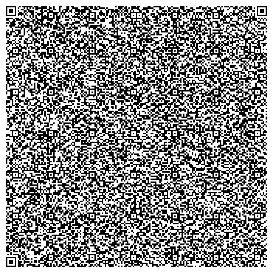

##### Camille's GO Encryption Tool
# (Currently trying to figure out a better name)

It's what it says on the tin, encryption tool written in go.
Allows you to create an AES key of 128, 256 or 512 bits, and use that key to encrypt/decrypt files.
Uses goroutines to parallel-process files, in order to enhance performance.

QR Code for the download of the Windows version (.exe)

QR Code for the download of the Linux version (ELF)

Checksums : 

c4155ba015a052f0338f0b18c31d733c53f56b35f4c6322dbc6e3fadc00c261d  stripped-encryption.go_linux
654784c1bf8e31d13ca6ce86cfa0b39b803320dd2232b43008b7b0de56997ec4  stripped-encryption.go_windows.exe

### Here is a silly side thing I did with this code
You'll also find here "stripped-encryption.go", the source code for a stripped version of the AES encryption tool. I managed to get it to be just near 2.9kB by stripping as much code as I could, which resulted in rougher corners, rougher edges, and no error management. It's more of a proof of concept / personal challenge I set myself. The big qr code contains the source code of the stripped version, you should be able to scan it and get the exact contents of "stripped-encryption.go". 

You can see the stripped version in there :

# Original goal
My original goal was to get the compiled version of the stripped tool into a qr code, as I've seen [mattkc](https://mattkc.com/etc/snakeqr/) do. Sadly, I currently lack the expertise and knowledge to do so (In my tests, the resulting executable was a thousand times bigger than it's source code, and by extension a thousand times too big to fit even if the biggest QR code format), especially given that I don't feel comfortable enough to tinker around with compiler settings. 
